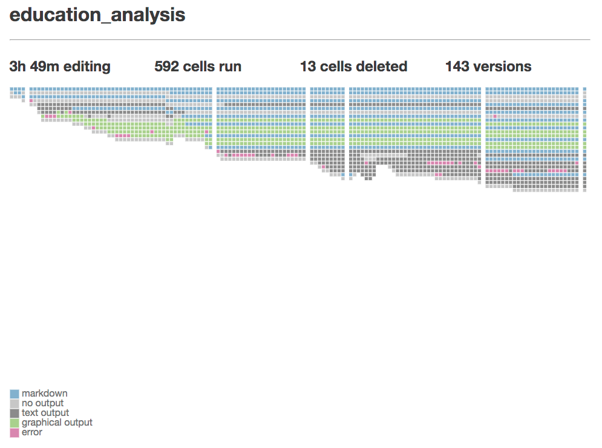

# Comet (Server Extension)
Comet is a Jupyter Notebook server extension that tracks changes to the notebook over time. It works in tandem with the [Comet notebook extension](https://github.com/activityhistory/comet). You must have both the server and notebook extension installed for the tracking to work properly since the notebook extension listens for events and sends information to the server extension for processing.

  

## What Comet Tracks
Comet tracks how your notebook changes over time. It does so by:
1. tracking the occurrence of actions such as creating, deleting, moving, or executing cells
2. tracking how your notebook changes as a result of these actions

Comet tracks this information in three ways:
1. committing every notebook change to a local git repository
2. periodically saving a full version of the notebook
3. saving the name and time of every action to an sqlite database

Comet is a research tool designed to help scientists in human-computer interaction better understand how people use Jupyter Notebooks. It is primarily a recording tool with very limited support for visualizing or reviewing the recorded data.

## Installation
The Comet server extension may be installed by downloading the entire repo, opening a terminal, navigating to folder containing the downloaded repo, the and running `python setup.py install` to install the package. 

You will also need to change your `jupyter_notebook_config.py` file to tell Jupyter to run the extension. Typically this file resides in a folder called `.jupyter` on your home directory. On macOS, You can reach this file by opening your terminal and typing:

```
open ~/.jupyter
```

If you do not see the file there, you can generate one by running the following command:

```
jupyter notebook --generate-config
```

Once you have the file, insert the following lines.

```
c = get_config()
c.NotebookApp.nbserver_extensions = {'comet_server.comet_server':True}

```

By default, Comet with store its data in the `.jupyter` folder under your home directory; for example `Users/username/.jupyter` for mac users. We suggest you can change this parameter by editing the `notebook.json` configuration file in the `.jupyter/nbconfig` folder to include a line specifying your data directory. For example: `"Comet": {"data_directory": "/full/path/" }`.

See the [Comet repo](https://github.com/activityhistory/comet) for instructions on how to install the frontend notebook extension.
